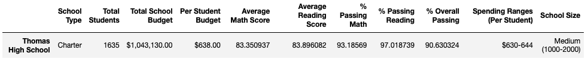

# School District Analysis

## Overview

### Background and Purpose

Maria, a chief data scientist for a city school district, and her supervisor have been notified that the “students_complete.csv” file (a dataset) shows evidence of academic dishonesty. This is specific to the reading and math grades for Thomas High School ninth graders, which appear to have been altered.

The purpose of this analysis is to help Maria replace the math and reading scores for Thomas High School with NaNs (Not a Number) while keeping the rest of the data intact. Additionally, she has requested to use Python and the Pandas library to analyze school district data and showcase trends in school performance with the updated numbers. 

These insights are used to inform discussion and strategic decisions at the school and district level. Moreover, the updated analysis will assist the school board, the superintendent and stakeholders in making decisions regarding the school budgets and priorities for the upcoming school year.

## Results

### Datasets and Files

The school district analysis is based on the following datasets: 
* School Data: [schools_complete](Resources/schools_complete.csv)
* Student Data: [students_complete](Resources/students_complete.csv)

The updated school district analysis is available here: [PyCitySchools_Challenge](PyCitySchools_Challenge.ipynb)

### Software and Application

The software and web-based application used for this analysis are:
* Python 3.7.11 (using PythonData environment and Pandas Library)
* Anaconda 4.11.0
* Jupyter Notebook 6.4.6

### Outcomes 

* How is the district summary affected?

The school district summary is a high-level snapshot of the district's key metrics: Total number of students, Total number of schools, Total budget, Average math score, Average reading score, Percentage of students who passed math, Percentage of students who passed reading and Overall passing percentage. Even after the reading and math scores for the ninth grade at Thomas High School were replaced with NaNs, the school district summary was affected with a slight negative change across the board, except for the Average Reading Score which stayed at 81.9.

Prior to replacing scores for the ninth grade at Thomas High School, the school district summary DataFrame was as follows:


In comparison/contrast, the updated school district summary DataFrame is shown below:


By chaining the **map()** and **format() functions** I was able to clean up the DataFrame and represent data appropriately, such as with a U.S. dollar sign, two decimal places and a thousands separator. This will make the data look cleaner and professional. 

This line of code was used to format the "Total Budget" column in the school district summary DataFrame:

```
district_summary_df["Total Budget"] = district_summary_df["Total Budget"].map("${:,.2f}".format) 
```

* How is the school summary affected?

The school summary is a snapshot of each school in the district with key metrics such as School name, School type, Total students, Total school budget, Per student budget, Average math score, Average reading score, % passing math, % passing reading and % overall passing.

It was determined that math and reading grades of 461 students in the 9th grade at Thomas High School were not going to be considered for both the school district summary as well as the school summary. Therefore, only the math and reading grades of students in the 10th, 11th and 12th  grade were being calculated for Thomas High School instead to uphold state-testing standards.

To calculate passing scores, it is critical to keep in mind that for assessment tests, the passing score is 70, with the >= 70 statement to filter the grades (that are passing).

For example, to calculate the overall passing percentage for the 10th to 12th grade at Thomas High School the total count of passing grades for math and reading was divided by the new total student count, which is 1,174, and then multiplying it by 100. The following code was used:

```
ThomasHS_passing_mathreading = pd.DataFrame(student_data_df.loc[(student_data_df['school_name'] == 'Thomas High School') & (student_data_df["math_score"] >= 70) & (student_data_df["reading_score"] >= 70)])

ThomasHS_overallpassing_mathreading_percentage = ThomasHS_passing_mathreading.count()["student_name"] / ten_eleven_twelve_count * 100

ThomasHS_overallpassing_mathreading_percentage

90.63032367972743
```

Then to replace the overall passing percentage in the school summary DataFrame with the updated 90.63 overall passing percentage for Thomas High School, this code was added:

```
per_school_summary_df.loc[['Thomas High School'], ['% Overall Passing']] = ThomasHS_overallpassing_mathreading_percentage
per_school_summary_df
```

The updated school summary DataFrame for Thomas High School is highlighted in blue as shown below:


* How does replacing the ninth graders’ math and reading scores affect Thomas High School’s performance relative to the other schools?

The average scores with the new calculation were not significantly affected by the removal of the 9th grade scores. In fact, Thomas High School had an overall passing rate of 90.63%, which kept them in second place of the top 5 highest performing schools, which are based on the overall percentage of passing students. To show the top five schools based on the overall passing rate the following code was used:

```
top_schools = per_school_summary_df.sort_values(["% Overall Passing"], ascending=False)
top_schools.head(5)
```

The top 5 highest performing schools DataFrame is shown as follows with Thomas High School highlighted in blue:


* How does replacing the ninth-grade scores affect the following:

**Math and reading scores by grade**

As shown below, replacing the ninth-grade scores with NaN affected the grade representation displayed for Thomas High School in both DataFrames of the math and reading scores by grade, respectively. 


**Scores by school spending**

The school spending per student were sorted into four spending "bins," or ranges. The four bins are dollar amounts that range from the lowest amount ($578) to the highest amount ($655) a school spends on a student.


As shown in the DataFrame below, the Thomas High School is in the spending ranges of "$630-644" per student, a healthy spending budget per student. In this instance, replacing the ninth-grade scores had a minimal effect to the spending range.


The DataFrame below lists all schools in the district with its respective spending range per student. Despite some schools counting with a healthy spending budget per student it does not necessarily equate to a top performing school.
 


**Scores by school size**

In this analysis, schools were grouped into three bins: small, medium, and large. The school size bins are as follows:

* "Small" schools have fewer than 1,000 students
* "Medium" schools have 1,000–1,999 students
* "Large" schools have 2,000–5,000 students

The highest student population is 4,976, which is Bailey High School. By organizing the total number of students per school into these size bins we can state that Thomas High School is in the "Medium (1000-2000)" size bucket. 



If we view the summary of scores by school size, we can quickly see how the school size greatly impacts the school scores. Schools smaller than 2,000 students are high performing schools as seen below:


**Scores by school type**

The school data can also be view by school type, charter and district. The school type summary below shows that charter schools have higher scores across the board. Thomas High School is a Charter school that is a high performing school despite replacing the ninth-grade scores.


## Summary of the School District Analysis

Summarize four changes in the updated school district analysis after reading and math scores for the ninth grade at Thomas High School have been replaced with NaNs.

In summary, 
Based on the output, we determined that all of the columns we need to use for calculations are integers. Therefore, we won't need to change the data types for these columns. However, there may be instances in which it's necessary to change the data type. 
If we do nothing, when we sum or take the averages of the reading and math scores, those NaNs will not be considered in the sum or the averages (just as they are not considered in the sum or the averages in an Excel file). In this situation, the missing values have no impact.
Maria would like you to use Pandas to do a more thorough inspection of the datasets than you did when you opened them with Excel. Cleaning the data is essential because any missing, malformed, or incorrect data in the rows can jeopardize the analysis.
The top five highest-performing schools based on the highest % Overall Passing are charter schools that have a low student population. 
The five lowest-performing schools based on the lowest "% Overall Passing" are district schools that have a high student population.
As stated earlier, this updated analysis will help the district officials determine how much money should be allocated to each school for the upcoming academic (school) year.

In summary, the election-audit successfully analyzed the election results for a US congressional voting district in Colorado using Python and Visual Studio Code. In general, Python code is easy to write, it can perform complex calculations quickly and can handle large data files. Visual Studio Code, or VS Code, allows you to write, edit, save and execute scripts. 

Congressional elections determine who represents your state in Congress and occur every two years. These midterm elections occur halfway between presidential elections and use the popular vote to choose winners.

The election commission can highly benefit from using software like Python and Visual Studio Code to automate the process of reporting results, especially when they must be run every two years. The Python script provided in this election-audit analysis can be easily used with a few adjustments for any election across the United States. 

Lastly, Python is a powerful tool that allows programmers access, process, manipulate and store large data files. Organizations in many industries can take advantage of it to simplify and automate processes of repetitive calculations to boost efficiency.
